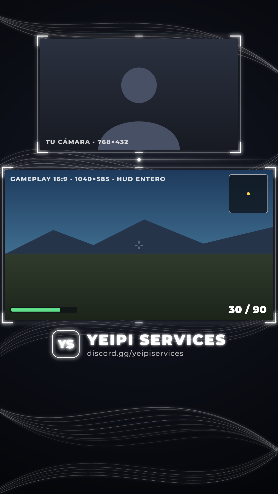

# Broadcast TikTok — Yeipi Services

Overlay vertical (1080 × 1920) para los directos de TikTok de Yeipi Services: fondo oscuro con hilos de luz blanca, el mismo estilo del pack del 2 de septiembre. Hay versión animada en bucle y versión quieta.



## Diseño actual (v2.1 generado · v2.3 en preparación)

| Zona | Posición | Tamaño |
| --- | --- | --- |
| Cámara (arriba, más pequeña) | X=156 Y=150 | 768 × 432 (16:9) |
| Gameplay (abajo, entero) | X=20 Y=660 | 1040 × 585 (16:9) |
| Marca | debajo del juego | logo YS · YEIPI SERVICES · discord.gg/yeipiservices |

La cámara y el juego van en 16:9, así que ninguno de los dos se recorta: el HUD del juego se ve entero y la cámara también.

En preparación: versión animada en bucle sin salto (ya está en el código, falta generarla):

- los hilos del fondo ondulan y llevan destellos de luz que los recorren;
- dos destellos dan vueltas a cada marco y las esquinas respiran;
- unas motas de luz flotan por el fondo y una mancha de luz muy suave se mueve despacio;
- un brillo cruza la marca una vez por bucle;
- debajo de la marca, un rótulo va cambiando solo entre los servicios (3 s cada uno), con transición, destello del marco y puntos que marcan cuál va. **Los servicios de `CONFIG.marca.servicios` todavía son textos de ejemplo.**

## Archivos listos para OBS

Los tienes en [`salida/`](salida). Ahora mismo están los de la v2.1 (quieta); los animados se crean con `npm run animar`:

- `overlay-animado.webm`: el overlay en bucle, con los huecos transparentes. En OBS va como «Fuente multimedia» con «Bucle» marcado y la decodificación por hardware desactivada; si no, la transparencia sale en negro.
- `overlay.png`: el mismo overlay quieto.
- `vista-previa-animada.mp4` y `vista-previa-animada.gif`: cómo queda en movimiento con una cámara y un juego de ejemplo.
- `vista-previa.png`: vista previa quieta.
- `LEEME.txt`: los pasos para montarlo en OBS, con posiciones y tamaños.

## Cambiar el diseño

Todo lo que se suele tocar está en el bloque `CONFIG`, al principio de [`diseno.js`](diseno.js): el tamaño y la altura de la cámara y del juego, los textos de la marca, los colores, la `semilla` que da forma a los hilos del fondo y la duración del bucle.

```bash
npm install
npm run generar   # overlay.png, vista-previa.png y LEEME.txt
npm run animar    # overlay-animado.webm y las vistas previas animadas (tarda unos minutos)
```

Si pones una cámara igual o más grande que el juego, un tamaño que no es 16:9 o huecos que se solapan, los scripts lo avisan. `npm install` baja también ffmpeg (paquete `ffmpeg-static`), así que no hace falta instalarlo aparte.

## Historial

- **v1 (2 sep):** estilo «CANTO» con hilos de luz blanca y juego 16:9 sin recortar.
- **v2:** cámara a todo el ancho arriba, juego más pequeño abajo y la marca Yeipi debajo.
- **v2.1:** cámara más pequeña que el gameplay. El juego pasa a ser lo más grande (1040 × 585) y la cámara, 768 × 432, sale entera sin recortar los lados.
- **v2.2 / v2.3 (en preparación):** versión animada en bucle (WebM con transparencia) con fondo oscuro, hilos que se mueven, destellos en los marcos, brillo en la marca y rótulo de servicios que va cambiando solo.

La fuente es Montserrat (licencia SIL OFL, en [`fuentes/OFL.txt`](fuentes/OFL.txt)).
